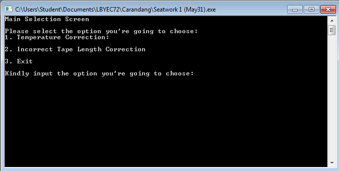
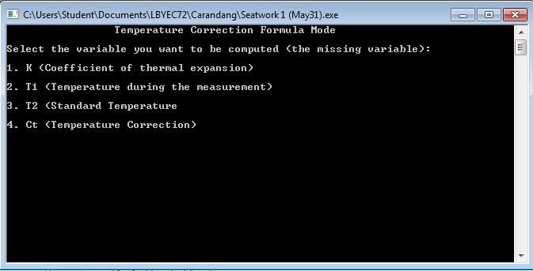
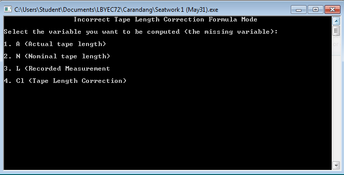

# prelimactivitynumber2-donotincludeanycode-mathewgabsam
prelimactivitynumber2-donotincludeanycode-mathewgabsam created by GitHub Classroom
# prelimactivitynumber2-donotincludeanycode-mathewgabsam
Unfinished

So I am finally finished with my main screen. 

  I could now select the formula I am going to use for this Project
 
Formula#1  

 
Formula#2   

To be continued
